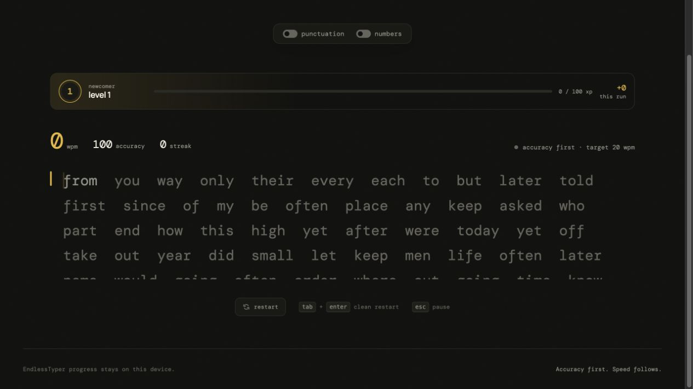

<div align="center">
  

  <br />

  <a href="https://mehedishakeel.github.io/EndlessTyper/"><strong>⌨️ Visit EndlessTyper Here</strong></a>

  <br /><br />

  
  
  
</div>

## About EndlessTyper

EndlessTyper is an accuracy-first typing trainer built for focused practice without countdowns, forced endings, or distractions. It measures performance in real time, rewards clean typing, and gradually introduces harder vocabulary as the user improves.

<p align="center">
  <a href="https://mehedishakeel.github.io/EndlessTyper/">
    
  </a>
</p>

## What makes it different

| Feature | Experience |
| --- | --- |
| ∞ Unlimited practice | Keep typing for as long as you want—there is no timer or forced finish. |
| ⚡ Live feedback | See WPM, accuracy, and your correct-word streak as you type. |
| 🏅 Level progression | Earn XP, unlock numbered levels, and meet increasingly challenging vocabulary. |
| 🎯 Accuracy-aware rewards | Correct words earn the most XP; imperfect words still earn less XP so practice never stalls. |
| `.,?` Punctuation mode | Add punctuation to strengthen real-world typing control. |
| `123` Number mode | Mix numbers into sessions for broader keyboard practice. |
| ◐ Personal controls | Switch themes, pause, restart, and enable optional key sounds. |

## How it works

1. Start typing the highlighted word.
2. Press the **space bar** to complete it and move to the next word.
3. Watch your speed, accuracy, streak, and XP update live.
4. Keep your accuracy high to level up faster and unlock harder words.

## Keyboard controls

| Keys | Action |
| --- | --- |
| `Space` | Complete the current word |
| `Esc` | Pause or resume |
| `Tab` + `Enter` | Clean restart from level 1 |

## Project structure

```text
EndlessTyper/
├── index.html
├── styles.css
├── app.js
├── assets/
│   ├── typing-animation.svg
│   └── endlesstyper-preview.jpg
└── .github/
    └── workflows/
        └── pages.yml
```

The application is intentionally lightweight and uses plain HTML, CSS, and JavaScript.

## Privacy

EndlessTyper has no accounts, analytics, or cloud-stored typing history. Progress and theme preferences remain in the user's browser through `localStorage`.

<div align="center">
  <sub>Accuracy first. Speed follows.</sub>
</div>
